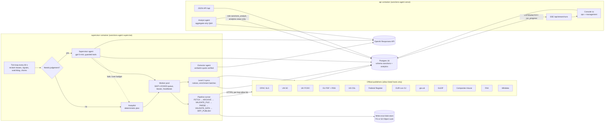
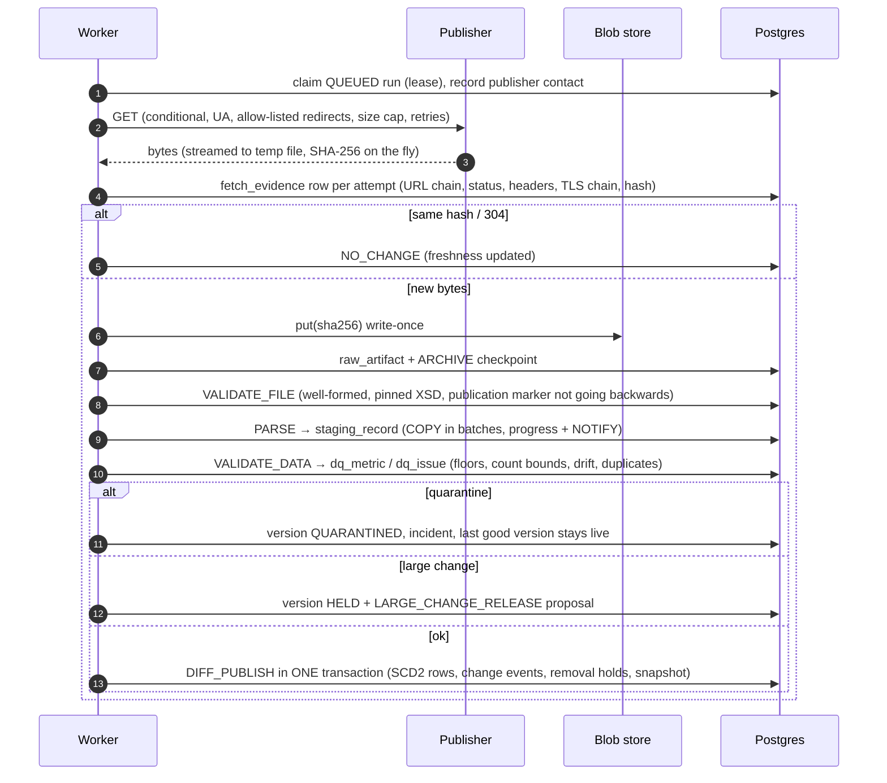
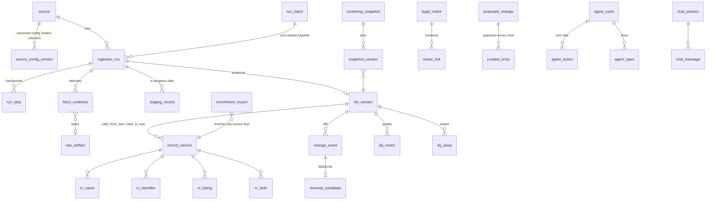

# Architecture

This service replaces the LexisNexis list feed with data taken straight from the official publishers (BRD
Level 1) plus free enrichment and legal evidence (Level 2). Paid Level 3 sources are out of scope.

The main design rule, from BRD §18: **deterministic code fetches, parses, validates and publishes. The LLM
agent supervises.** The agent decides what to pull and when, diagnoses failures, extracts facts from
unstructured notices and files proposals. It never parses a structured list, and it never writes published
data. A human approves everything it extracts.

## Components

* **Supervisor process:** the scheduler tick, a bounded worker pool, the deterministic autopilot and
  watchdog, and the LLM supervisor. Several supervisors can run at once. Runs are claimed with
  `FOR UPDATE SKIP LOCKED` under leases, and each source has one active run, enforced by a partial unique index.
* **API process:** the JSON API, the server-rendered console (Jinja2 plus vanilla JS under a strict CSP,
  with Chart.js vendored), Server-Sent Events for live progress, and the analyst Q&A agent.
* **Postgres:** the single source of truth. That covers live source configuration (edited in the UI;
  `config/sources.yaml` is only a seed), runs, evidence, versioned list data, review queues and agent traces.
* **Blob store:** raw publisher files, content-addressed by SHA-256 and write-once (`0444` plus `O_EXCL` on FS;
  S3 Object Lock in production). Every published version can be rebuilt from its archived bytes.

## Scheduling and batches

* **Clock-aligned intervals.** An interval schedule fires on multiples of its cadence since the UTC epoch:
  "every 2 h" is 00:00, 02:00, … UTC. Sources with the same cadence therefore fall due in the same tick.
  * Each tick's queued runs, including watchdog-forced and signal-triggered pulls, form one **SCHEDULED
    batch**. The batch is created lazily, so a quiet tick creates nothing.
  * After a pull, the next due slot is the first one that also respects the politeness interval, with a
    small allowance for tick jitter.
  * Retries after failures are not aligned. They fire early and join whichever cycle is current.
* **Other batches.**
  * Each supervisor-agent cycle has one **AGENT batch**, which also records the requests its guards refused.
  * Each ad-hoc request is one **MANUAL batch** (`POST /api/batches`, or `POST /api/sources/{id}/runs` for
    a batch of one).
  * A crash-recovered run keeps its batch as attempt 2.

## Ingestion pipeline (per run)

### How in-progress data moves (transaction boundaries and crash recovery)

In-progress data lives only in `staging_record` / `staging_path_stats`, scoped by `run_id`. Screening,
analytics views and the Q&A agent never read staging. It becomes published data only inside the single
DIFF_PUBLISH transaction.

| Step | Writes | Transaction | If the process dies here |
|---|---|---|---|
| FETCH | Temp file; `progress` (throttled, with NOTIFY); one `fetch_evidence` row per attempt; `source.last_attempt_at` recorded *before* the download | Short transactions | The lease expires. The run is reclaimed as ABANDONED and a child run starts. The temp file is discarded |
| ARCHIVE | Blob (idempotent by hash); `raw_artifact` ON CONFLICT DO NOTHING; checkpoint | One | The child run resumes from the archived bytes, with **no new download** |
| VALIDATE_FILE | Candidate `list_version`, `dq_issue` | One | Re-run (deterministic) |
| PARSE | `staging_record` via COPY in 5k batches; `progress.records_done` | One per batch | The dead run's staging is purged and the file is re-parsed from the archive |
| VALIDATE_DATA | `dq_metric`, `dq_issue`, version VALIDATED / HELD / QUARANTINED | One | Re-run |
| DIFF_PUBLISH | `record_version` open/close + `rv_*` children, `change_event`, `removal_candidate`, `crosslist_key`, version PUBLISHED (previous SUPERSEDED), `screening_snapshot`, `source.current_version_id`, run SUCCEEDED, NOTIFY | **One**, holding `FOR UPDATE` on the source row | Postgres rolls back and the resumed run redoes it. Screening never sees half-published data |
| RELEASE_HELD | Same as DIFF_PUBLISH, from the retained staging, after a reviewer approves | One | Same |

After a successful publish, staging is purged. For HELD and QUARANTINED runs it is kept for 7 days
(`staging_retention_days`) so the candidate can be diagnosed or released.

**Politeness and freshness are tracked separately.** Contacting a publisher moves `last_attempt_at`, the
politeness clock. New data moves `last_success_at`, the freshness SLO; new data means a fetch, an
out-of-band manual load or a curated build. A re-parse of archived bytes after a parser fix moves neither,
so it cannot block the next real pull or hide staleness.

## Data model

Schema `sanctions` (migration `0001_init`), plus the aggregate-only schema `analytics` (migration `0002_analytics`).

| Group | Tables | Notes |
|---|---|---|
| Control plane | `source`, `source_config_version`, `system_setting`, `run_batch`, `ingestion_run`, `run_step`, `signal`, `incident` | Mutable and audited (`audit_log` trigger records old/new row, actor, time) |
| Batches | `run_batch` (type, requester, reason, mode, requested sources, refused sources with reasons); every `ingestion_run.batch_id` is NOT NULL | Scheduled cycle, agent cycle, or ad-hoc request. Status is **derived** in `analytics.v_run_batches` from the latest attempt per source, never stored |
| Evidence (BRD §9.4) | `raw_artifact`, `fetch_evidence` (partitioned monthly) | **Append-only**: a trigger raises on UPDATE/DELETE. Failed attempts are recorded too |
| In-progress | `staging_record`, `staging_path_stats` | Keyed by `run_id`; never read by screening |
| Published lists | `list_version`, `record_version` + `rv_name / rv_identifier / rv_address / rv_birth / rv_nationality / rv_listing / rv_relationship / rv_vessel / rv_aircraft` | SCD2 by per-source sequence. `doc` holds the full canonical record (hash and diff); `rv_*` are its immutable relational projection |
| Changes and removals | `change_event`, `removal_candidate`, `crosslist_key` | A REMOVE keeps blocking until a human confirms (FR-10) |
| Screening reproducibility (FR-18) | `screening_snapshot`, `snapshot_version`, `records_as_of(snapshot_id)` | Returns the exact records any screening decision used, including held removals |
| Level 2 | `legal_notice`, `notice_link`, `enrichment_record`, `enrichment_request` | On-demand personal-data lookups are logged (NFR-07) |
| Human review | `proposed_change`, `curated_entry` | Everything the agents propose; maker-checker enforced |
| Quality | `dq_metric`, `dq_issue`, `field_catalog` | Aggregates only; `field_catalog` is generated from the parsers' declared field mappings |
| Agent | `agent_cycle`, `agent_action` (append-only), `agent_span` (partitioned), `chat_session`, `chat_message` | Every tool call, guard verdict, token and dollar |

`analytics` holds views only: `v_source_status`, `v_run_summary`, `v_run_progress`, `v_version_counts`,
`v_fill_rates`, `v_quality_metrics`, `v_change_volume`, `v_dq_issues`, `v_enrichment_coverage`,
`v_notice_coverage`, `v_notices`, `v_removal_holds`, `v_proposals`, `v_incidents`, `v_agent_activity`,
`v_agent_tool_usage`, `v_signals`, `v_snapshots`, `v_field_catalog` and `v_fetch_health`. None of them has a
name, identifier, address or date-of-birth column. The role `sanctions_analyst` can read only this schema,
in read-only transactions with a 5 s statement timeout.

## Self-healing layers

| Layer | Mechanism |
|---|---|
| Transport | Retries with exponential backoff and jitter per source (EU FSF: at least 5 attempts); `Retry-After`; one evidence row per attempt; error taxonomy (`ErrorClass`) drives every later decision |
| Run | Checkpoints, leases and heartbeats. Expired leases are reclaimed as ABANDONED and resumed from the archived file. Cooperative cancel between batches |
| Source | Persistent circuit breaker (closed → open → half-open probe) with adaptive retry scheduling |
| Data | Quarantine or hold keeps the last good version live. Re-parse archived bytes after a parser fix. Schema-drift report against reviewed known paths |
| Watchdog | Forces a pull of any active source past its hard staleness ceiling, whatever the agent is doing; raises page incidents |
| Agent | Diagnosis playbooks per error class. Incidents are opened, updated and resolved with deduplicated alerts. Removal confirmation by evidence search and cross-list check |
| Agent failure | OpenAI down, a timeout or the daily budget reached means the cycle falls back to the deterministic autopilot (`fallback_used`). Ingestion never depends on the LLM |

## Agents

**Supervisor** (`agent/supervisor.py`). It runs only when the gate finds something needing judgement: failures,
open or half-open breakers, held or quarantined versions, drift, new signals or notices, unevidenced removals,
review backlog, or the periodic health review. It gets a compact state snapshot, never list data, and
returns a structured `CycleReport`. Its tools are guarded:

* **Read tools** show status, runs, errors, validation reports, signals, removal candidates and notices.
* **Act tools** can run an ingestion, schedule a retry, open a breaker, resume, re-parse, sync notices,
  extract a notice or annex act, check a removal, run enrichment, discover a moved download link, manage
  incidents, send alerts and propose changes. The guards enforce status, politeness, breaker state and
  per-cycle caps.
* **Denied to the agent:** approving anything, publishing held versions, editing URLs, hosts or the
  allow-list, deleting, and writing published data.

**Extractors** (`agent/extractors.py`). They produce structured output from notice and OJ text, and every
extracted value carries a verbatim quote. A deterministic verifier checks that the quote and the value
occur in the text and that IMO and LEI checksums pass. It also cross-checks row counts against regex
counts of the source text. Everything becomes a `proposed_change` for a human.

**Analyst** (`agent/analyst.py`). It answers questions about ingestion status, fields, counts and quality.
Three independent layers keep it at aggregate level:

1. A deterministic input guardrail refuses row-level questions ("is X sanctioned", "list the names...")
   before any model call.
2. Its 18 tools, including run batches and the free-form SQL escape hatch, read only `analytics` views. The SQL is
   parsed by sqlglot: one SELECT, allow-listed functions, and a limit of 500 rows.
3. The database role cannot read `sanctions.*` at all.

All three agents are traced into `agent_cycle` / `agent_action` / `agent_span`. Export of traces to
OpenAI is off by default.

## Security

* **Outbound traffic:**
  * `config/allowed_hosts.yaml` is the global allow-list. It is changed only through code review, never
    from the UI. Each source's `allowed_hosts` must be a subset of it.
  * Every redirect hop is checked against both lists. The client also has an SSRF guard (private and
    loopback addresses are blocked) and refuses non-HTTPS URLs.
  * Signed URLs are redacted in logs and evidence.
* **Parsing:** hardened `lxml`, with no entity resolution, no network access, no DTD and size caps.
* **Configuration changes:**
  * URL, host and header changes are security-sensitive. A second admin must approve them.
  * Every change is a new audited `source_config_version`.
  * Optimistic locking: `If-Match` / `expected_version`, with 409 on a stale edit.
* **Console:**
  * Roles are viewer < operator < reviewer < admin.
  * Auth is `basic` in development, or `proxy` in production (trusting `X-Forwarded-User` from an SSO
    gateway).
  * CSP `script-src 'self'` with no inline scripts. Untrusted text is only ever inserted as text.
